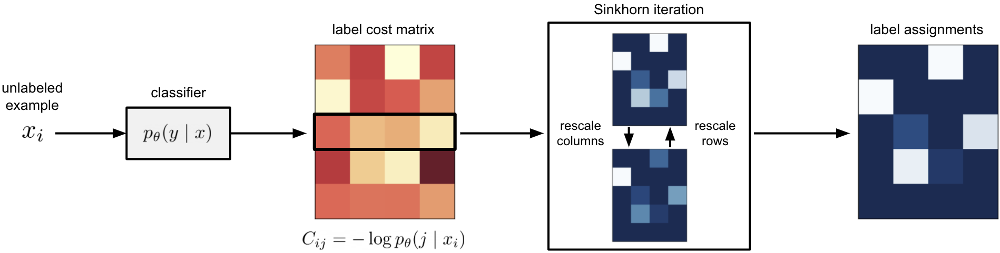

# Sinkhorn Label Allocation: Semi-Supervised Classification via Annealed Self-Training

<p align="center">
  
</p>

Self-training is a standard approach to semi-supervised learning where the learner's own predictions on unlabeled data are used as supervision during training. 
Sinkhorn Label Allocation (SLA) models this label assignment process as an optimal transportation problem between examples and classes, wherein the cost of assigning an example to a class is mediated by the current predictions of the classifier.
By efficiently approximating the solutions to these optimization problems using the Sinkhorn-Knopp algorithm, SLA can be used in the inner loop of standard stochastic optimization algorithms such as those used to train modern deep neural network architectures.  

## Environment

We recommend using `conda` to install dependencies:

```sh
$ conda env create -f environment.yml
$ conda activate sinkhorn-label-allocation
```

## Usage 

SLA can be run with a basic set of options using the following command:

```sh
$ python run_sla.py --dataset cifar10 --data_path /tmp/data --output_dir /tmp/sla --run_id my_sla_run --num_labeled 40 --seed 1 --num_epochs 1024 
```

Similarly, the FixMatch baseline can be run using `run_fixmatch.py`:

```sh
$ python run_fixmatch.py --dataset cifar10 --data_path /tmp/data --output_dir /tmp/sla --run_id my_fixmatch_run --num_labeled 40 --seed 1 --num_epochs 1024 
```

The following datasets are currently supported: `cifar10`, `cifar100`, and `svhn`.

For a full set of commands, refer to the `main()` functions in `run_sla.py` and `run_fixmatch.py`.
